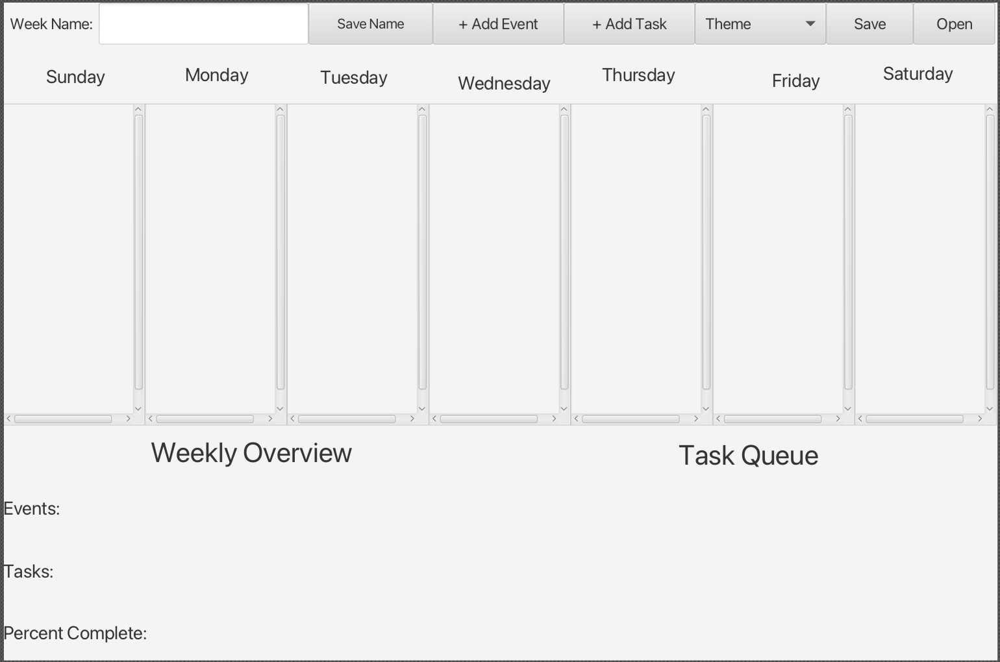

# 3500 PA05 Project Repo

[PA Write Up](https://markefontenot.notion.site/PA-05-8263d28a81a7473d8372c6579abd6481)

App pitch: 
Do you struggle to stay organized with all the different tasks in your everyday schedule? Google Calendar isn’t sufficient enough. Introducing SuccesfulHit’s new app, Object Oriented Calendar, aka OOC! Our calendar has several features to keep your week manageable, such as a horizontal display of all days in your current week, the ability to name and save specific week schedules (that are saved in a .bujo file), and holding a max number of events to make sure you do not overwhelm yourself. OOC also displays your current queue of tasks and allows you to use shortcuts on your keyboard to easily set up tasks and events. The app was designed for efficiency, it displays measures of total events, total tasks, and what percentage of tasks you have completed. It also supports a Mini Viewer feature which gives the user the ability to click on any task or event to see more detail. Change of plans? Our app also supports deleting/editing tasks and events if something changes! Our newest customizations are allowing the user to change what day the week starts and turn valid HTTP/HTTPS addresses into clickable links. 

Applying SOLID principles to our project:
S - Each of our classes had a single responsibility/task it handled. Classes like Theme, Task, and Week stored data that the controller used the view to display. 
O - We used the Open/Closed principle throughout the code, namely with the controller/controllerImpl class and the view/ViewImpl class. By using interfaces to represent the controller and view and then implementing them with the impl classes, we made sure our code was open for extension but closed for modification.
L - Liskov's substitution rule for the most part does not apply as we did not utilize extension in our project. But if we did, we would ensure that substituting any subclass with its superclass would not "break" the program (return incompatible type, throw an unexpected error, etc.)
I - Throughout our code, we made sure that no class had to rely on code it did not use. In other words, our interfaces were specific to our implementation and did not force classes to implement methods they did not end up using. 
D - For the most part, modules in our program did not rely on others as we tried to reduce coupling as much as possible. However, whenever there is a need for reliance, we used interfaces rather than allowing our high-level modules to depend on our low-level modules. 

Potential Extension:
Our project was designed for high levels of extensibility. For example, if we wanted to implement a Quotes & Notes section that would allow the user to enter a small note that would be displayed on the GUI, we would have to add a simple textbox and save button within our layout(specifically within the HBox at the top of our GUI). Within our controller, we would create @FXML fields to store the save button and textbox's data. Using an Action Event Handler we would store whatever is stored within the textbook when the button is pressed and display it to the user using a pane and a label. We designed our project so that any additions to GUI features simply need corresponding data fields in the controller so that the user interactions can be stored and handled by delegating to the model.

No images utilized
